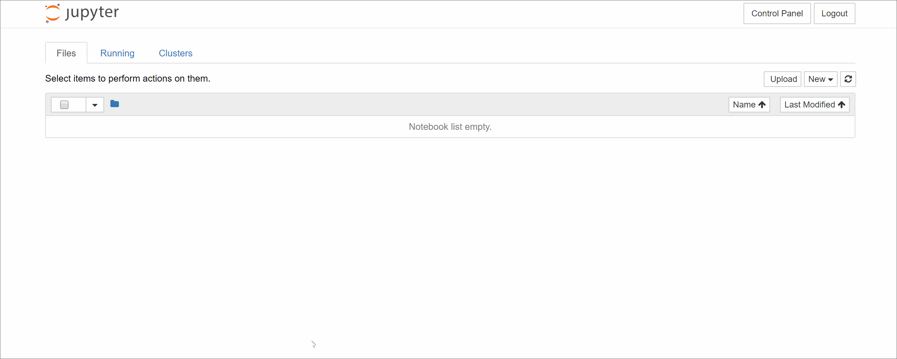

# nbgitpuller

[](https://mybinder.org/v2/gh/jupyterhub/nbgitpuller/master?urlpath=apps/binder%2Flink_generator.ipynb)

One-way synchronization of a remote git repository to a local git repository,
with automatic conflict resolution.

[YouTube video instructions for teachers.](https://youtu.be/o7U0ZuICVFg)




# Installation

You can install nbgitpuller from PyPI.

    pip install nbgitpuller

You can then enable the serverextension

    jupyter serverextension enable --py nbgitpuller --sys-prefix

# What is it?

nbgitpuller allows you to construct a URL that points to a remote git repository.
When it is clicked, nbgitpuller will pull the contents of this repository
into the user's current folder within Jupyter, while rendering a nice status page.
This is especially useful when running on a JupyterHub, since it allows easy distribution
of materials to users without requiring them to understand git.

# Merging behavior

When a link is clicked, we try to make opinionated intelligent guesses on how to
do a merge automatically, without making the user do a conflict resolution.
nbgitpuller is designed to be used by folks who do not know that git is being used
underneath, and are only pulling content one way from a source and modifying it -
not pushing it back.
So we have made the following opinionated decisions.


1. If content has changed in both places, prefer local changes over remote changes.
2. If a file was deleted locally but present in the remote, remote file is restored
   to local repository. This allows users to get a 'fresh copy' of a file by
   just deleting the file locally & clicking the link again.
3. If a file exists locally but is untracked by git (maybe someone uploaded it manually),
   then rename the file, and pull in remote copy.

# When to use nbgitpuller

You should use this when:

1. You are running a JupyterHub for a class & want an easy way to distribute materials to
   your students without them having to understand what git is.
2. You have a different out of band method for collecting completed assignments / notebooks
   from students, since they can not just 'push it back' via git.

You should *not* use this when:

1. You are an instructor using a JupyterHub / running notebooks locally to create materials
   and push them to a git repository. You should just use git directly, since the assumptions
   and design of nbgitpuller **will** surprise you in unexpected ways if you are pushing with
   git but pulling with nbgitpuller.
2. Your students are performing manual git operations on the git repository cloned as well as
   using nbgitpuller. Mixing manual git operations + automatic nbgitpuller operations is going
   to cause surprises on an ongoing basis, and should be avoided.

# How to use nbgitpuller

1. Visit the nbgitpuller link generator at https://jupyterhub.github.io/nbgitpuller/link.
2. Enter the IP address or URL to your JupyterHub. Include http:// or https:// as appropriate.
3. Enter an alternative URL path if desired. If not set, the generated link will take users to the default hub url, however this can be changed. For example specifying "lab" will launch JupyterLab if installed. Entering "path/to/a/notebook.ipynb" will open that notebook.
4. Enter the URL to your Git repository. This can reference any Git service provider such as GitHub, GitLab, or a local instance.
5. If your git repository is using a non-default branch name, you can specify that under branch. Most people do not need to customize this.

The link printed at the bottom of the form can be distributed to users. You can also click it to test that it is working as intended, and adjust the form values until you get something you are happy with.

# Local development

You can easily set up to develop this locally, without requiring a JupyterHub. It requires python3.

1. Clone this repository
   ```
   git clone https://github.com/data-8/nbgitpuller
   ```

2. Change into it and create a virtual environment
   ```
   cd nbgitpuller
   python3 -m venv .
   ```

3. Install it with symlinks, so you can easily play with it.
   ```
   pip install -e .
   ```
4. Enable the jupyter notebook server extension. This provides the `git-pull` URL handlers.
   ```
   jupyter serverextension enable --sys-prefix nbgitpuller
   ```
5. Run a jupyter notebook locally!
   ```
   jupyter notebook
   ```
6. Construct a nbgitpuller URL exactly like you would for a hub, but instead of prefixing it
   with `myjupyterhub.org/hub/user-redirect`, just use `localhost:8888` or whatever the
   url of your running notebook is. For example, the following URL would pull down a repo:
   ```
   localhost:8888/git-pull?repo=https://github.com/data-8/materials-fa17
   ```
7. Make the changes you want to make, and restart the jupyter notebook for them to take effect.

# Using the command line interface

It is also possible to use `nbgitpuller` from the command line. For example,
here's how to synchronize the repository listed above using the command line:

```
gitpuller https://github.com/data-8/materials-fa17 master my_materials_fa17
```

This will synchronize the `master` branch of the repository to a folder
called `my_materials_fa17`.

See the command line help for more information.
